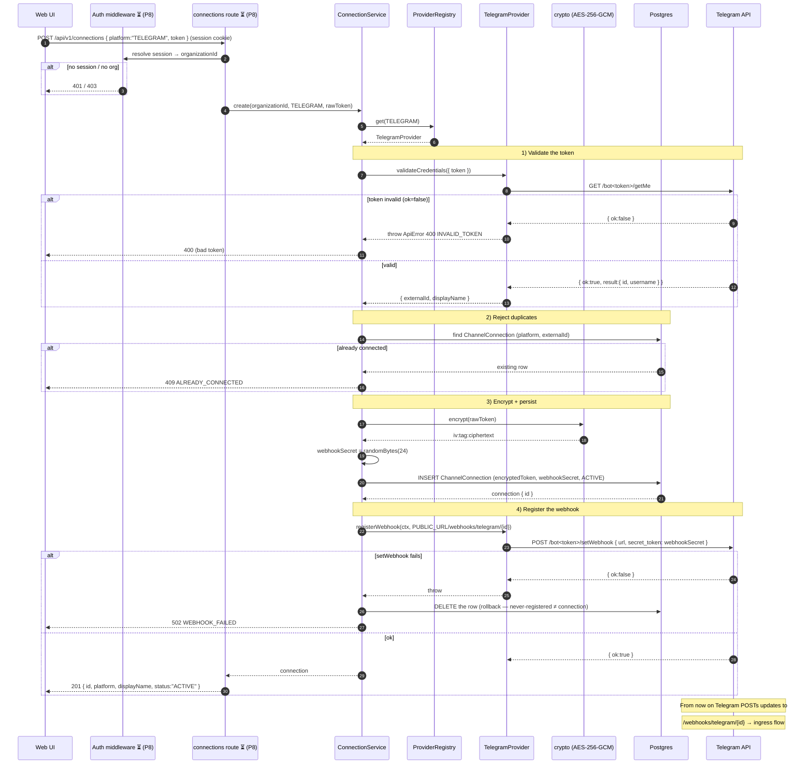

# Connecting a Bot — Token Submission Flow

What happens when a user pastes a **Telegram bot token** in the UI and submits it.
This is the **provisioning** flow (one-time, per bot). After it succeeds, inbound
messages follow the ingress flow in [`SCHEMA.md`](./apps/server/docs/SCHEMA.md).

> **Status:** `ConnectionService.create` + `TelegramProvider` (the engine) are
> **implemented** (Phases 4–5). The HTTP route `POST /api/v1/connections` and the
> auth middleware that resolves the org from the session are **Phase 8 (pending)** —
> marked ⏳ below. The service is already callable; only the route wrapper is missing.

---

## The big picture

```
User pastes token  ─►  POST /api/v1/connections  ─►  ConnectionService.create
                                                          │
                          ┌───────────────────────────────┼───────────────────────────────┐
                          ▼                                ▼                                ▼
                 validate w/ Telegram              encrypt + store row              register webhook
                 (getMe → bot id)                  (token never plaintext)          (point Telegram at us)
```

Two secrets are produced and stored: the **encrypted token** (to call Telegram later)
and a **webhookSecret** (to prove future webhooks are really from Telegram).

---

## Sequence diagram



---

## Step by step

### 0. The user gets a token
The user creates a bot with Telegram's @BotFather and copies the token
(`123456:ABC-DEF…`). They paste it into the "Add bot" form and submit.

### 1. Request to the server ⏳ (route is Phase 8)
The browser sends `POST /api/v1/connections { platform: "TELEGRAM", token }` with
the **better-auth session cookie** (`credentials: "include"`). The auth middleware
reads the session, derives the active **`organizationId`**, and rejects with 401/403
if there's no session/org. The handler then calls
`connectionService.create(organizationId, "TELEGRAM", token)`.

### 2. Resolve the provider
`ConnectionService` asks the `ProviderRegistry` for the provider that handles
`TELEGRAM` → `TelegramProvider`. (One provider per platform; see the registry docs.)

### 3. Validate the token (`validateCredentials`)
`TelegramProvider` calls Telegram's `getMe` with the token:
- **Invalid** (`ok:false`) → throws `ApiError(400, "INVALID_TOKEN")`. Nothing is stored.
- **Valid** → returns `externalId = String(result.id)` (the bot's permanent numeric id)
  and `displayName = result.username`.

This is the proof the token is real *before* we persist anything.

### 4. Reject duplicates
Look up `ChannelConnection` by the unique `(platform, externalId)`. If the bot is
already connected → `ApiError(409, "ALREADY_CONNECTED")`. (Note: this is **global**,
so the same bot can't be connected by two orgs — a bot has exactly one webhook URL.)

### 5. Encrypt + persist
- `encryptedToken = encrypt(rawToken)` — AES-256-GCM, stored as `iv:tag:ciphertext`.
  **The raw token is never written to the DB or logs.**
- `webhookSecret = randomBytes(24).toString("hex")` — a fresh per-bot secret.
- `INSERT` the `ChannelConnection` row (`status: ACTIVE`) scoped to `organizationId`.

### 6. Register the webhook (`registerWebhook`)
Build the per-bot URL `${PUBLIC_URL}/webhooks/telegram/{connectionId}` and call
Telegram's `setWebhook` with that `url` and `secret_token: webhookSecret`. From now
on Telegram delivers every update to that URL and echoes the secret in the
`X-Telegram-Bot-Api-Secret-Token` header.

**If `setWebhook` fails:** the just-created row is **deleted** and a
`502 WEBHOOK_FAILED` is thrown — a connection that never registered isn't a real
connection, so we roll back rather than leave a broken ghost row.

### 7. Response
`201 { id, platform, displayName, status }`. The UI shows the bot in the connected
list. The bot is now live — the next message a user sends it lands via the
[ingress flow](./apps/server/docs/SCHEMA.md#2-ingress--inbound-message-provider--db).

---

## What gets stored (one `ChannelConnection` row)

| Column | Value | Purpose |
|---|---|---|
| `id` | uuid | Goes into the webhook URL; ties incoming updates back to this bot. |
| `organizationId` | from session | Tenant scoping. |
| `platform` | `TELEGRAM` | Which provider speaks for it. |
| `externalId` | Telegram bot id (`getMe`) | Stable identity; half of the uniqueness key. |
| `displayName` | bot username | UI label. |
| `encryptedToken` | AES-256-GCM packed | The credential, encrypted at rest. |
| `webhookSecret` | 24 random bytes (hex) | Verifies future webhooks. |
| `status` | `ACTIVE` | Webhook handler only accepts ACTIVE bots. |

---

## Why this shape

- **Validate before persist** — never store a token that doesn't work.
- **Encrypt at rest** — a DB leak doesn't leak usable bot tokens.
- **Per-bot webhook secret** — the public webhook route needs no auth; the secret is
  the boundary.
- **Rollback on webhook failure** — no half-provisioned connections.
- **Provider does the Telegram-specific work** — adding WhatsApp later means writing
  one new provider with the same three methods (`validateCredentials`,
  `registerWebhook`, `adapter`); this whole flow is unchanged.
