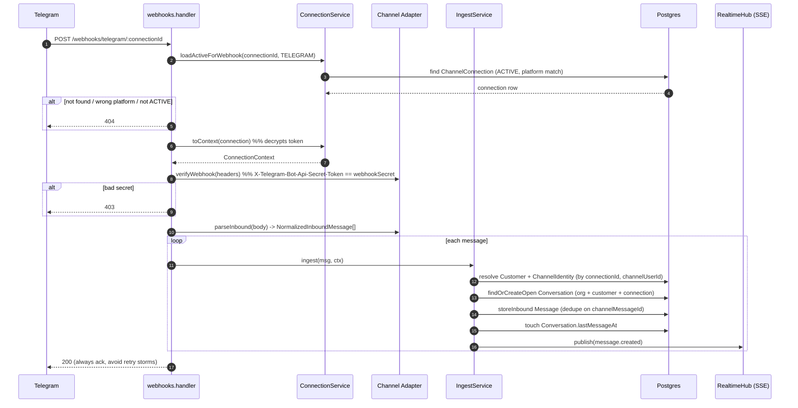
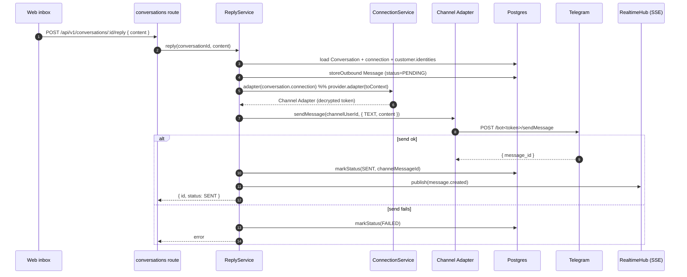

# Data Model & Message Flow

Schema and message-flow diagrams for the multi-bot omnichannel inbox.

- **Tenant** is `Organization` (better-auth organization plugin).
- **One `ChannelConnection` = one connected bot.** Per-platform capability lives in code (`ChannelProvider`); per-bot credentials live in the DB.
- **Ingress** = a message arriving from a provider (e.g. Telegram) → stored.
- **Egress** = an agent reply → sent back out via the correct bot.

---

## 1. Entity-Relationship Diagram

```mermaid
erDiagram
  Organization ||--o{ ChannelConnection : owns
  Organization ||--o{ Customer : has
  Organization ||--o{ Conversation : has
  Organization ||--o{ Member : has
  Organization ||--o{ Invitation : has

  User ||--o{ Session : has
  User ||--o{ Account : has
  User ||--o{ Member : "is"
  User ||--o{ Invitation : invited

  ChannelConnection ||--o{ ChannelIdentity : "seen on"
  ChannelConnection ||--o{ Conversation : scopes

  Customer ||--o{ ChannelIdentity : "appears as"
  Customer ||--o{ Conversation : participates

  Conversation ||--o{ Message : contains

  Organization {
    string id PK
    string name
    string slug UK
  }
  ChannelConnection {
    string id PK
    string organizationId FK
    enum   platform "TELEGRAM | ..."
    string externalId "provider bot id"
    string displayName "bot username/title"
    string encryptedToken "AES-256-GCM"
    string webhookSecret "per-bot secret"
    enum   status "ACTIVE|DISABLED|ERROR"
    json   meta
    uk     platform_externalId "UNIQUE(platform, externalId)"
  }
  Customer {
    string id PK
    string organizationId FK
    string displayName
  }
  ChannelIdentity {
    string id PK
    string customerId FK
    string connectionId FK
    enum   channel
    string channelUserId "provider user/chat id"
    uk     connectionId_channelUserId "UNIQUE(connectionId, channelUserId)"
  }
  Conversation {
    string id PK
    string organizationId FK
    string customerId FK
    string connectionId FK
    enum   channel
    enum   status "OPEN|PENDING|CLOSED"
    string assignedAgentId
    datetime lastMessageAt
  }
  Message {
    string id PK
    string conversationId FK
    enum   direction "INBOUND|OUTBOUND"
    enum   type "TEXT|IMAGE|FILE|AUDIO|VIDEO"
    string content
    string mediaUrl
    string channelMessageId "provider msg id (dedupe)"
    enum   status "PENDING|SENT|DELIVERED|READ|FAILED"
    json   raw
    uk     conversationId_channelMessageId "UNIQUE(conversationId, channelMessageId)"
  }
  Member {
    string id PK
    string organizationId FK
    string userId FK
    string role "owner|admin|member"
  }
  User {
    string id PK
    string email UK
    string name
  }
  Session {
    string id PK
    string userId FK
    string activeOrganizationId "resolves the tenant"
  }
  Account {
    string id PK
    string userId FK
    string providerId
    string password "credential auth"
  }
  Invitation {
    string id PK
    string organizationId FK
    string inviterId FK
    string email
  }
```

> **Auth models** (`User`, `Session`, `Account`, `Verification`, `Member`, `Invitation`, `Organization`) are owned by better-auth. The active tenant is resolved from `Session.activeOrganizationId`.
>
> **Domain models** (`ChannelConnection`, `Customer`, `ChannelIdentity`, `Conversation`, `Message`) are app-owned and all hang off `Organization`.

---

## 2. Ingress — inbound message (provider → DB)

A provider delivers an update to the per-bot webhook URL `…/webhooks/:channel/:connectionId`.
The route is **public**, secured by the connection's `webhookSecret` (not auth).



**Writes:** `Customer` (+`ChannelIdentity`) if new, `Conversation` if no open one, one `Message` (INBOUND). A duplicate webhook (same `channelMessageId`) is a no-op.

---

## 3. Egress — agent reply (DB → provider)

An agent replies from the inbox UI. The reply is sent via **the conversation's own bot** —
its connection's decrypted token — not a global one.



**Writes:** one `Message` (OUTBOUND), then a status update to `SENT` or `FAILED`.

> **Note (current state):** the `/api/v1/conversations` routes are **not yet org-scoped** — the auth middleware that resolves the tenant from the session and filters by `organizationId` arrives in **Phase 8**. The webhook (ingress) path is already fully connection-scoped.
